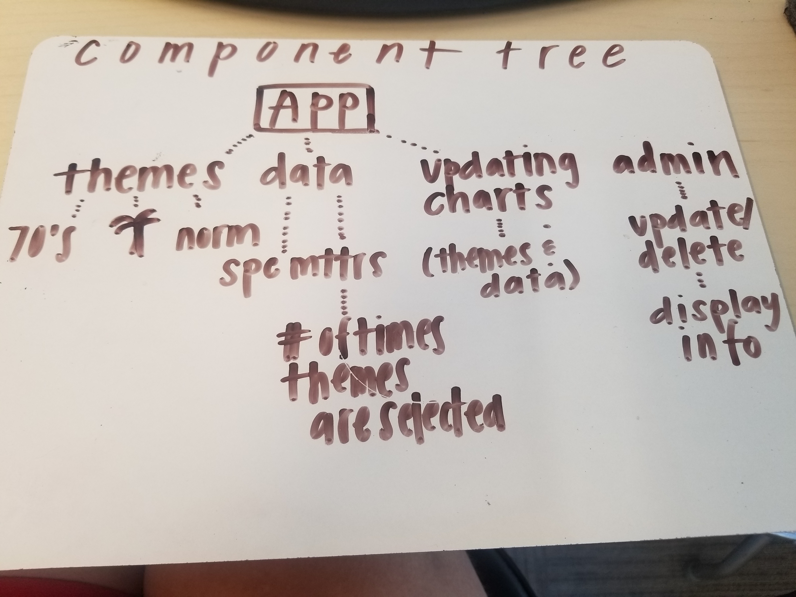
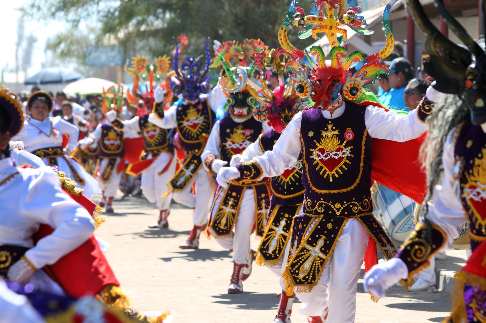
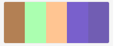
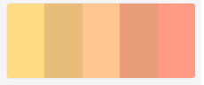

# Capstone Project Proposal
---
#### Nelia Terrazas
#### 5/10/19

### Project: Space Matters Site
_Purpose: Survey Site Designed to Display Derrick McDonald's Work for Space Matters._

#### Manual Commit History
5/3/19
* 8AM-9AM: Initial set up and exploration (elaborate)
* 9AM-10AM: UX research, brainstorm, colors on Adobe Colors.
* 10AM-11AM: UX Design Theory and planning
* 11AM-12PM:  React and Firebase exploration
* 12PM-1PM: Firebase Documentation
* 1PM-2PM: Research react-vis and 1st attempt, downloaded via npm.
* 2PM-3PM: Initial Component Tree / Look over Epicodus set up
* 3PM-4PM: Add Derrick's call and notes to Google Drawings
* Final hour: Made up attaching previous files to README and attaching original site screenshot.

5/10/19
* 8AM-9AM: Refactor component tree to better display how data will travel throughout App.
* 9AM-10AM: More research on changing state or other packages to assist with theme switch.
* 10AM-11AM: Try out @callstack/react-theme-provider
* 11AM-12PM: Refactor to include state and custom components
* 1PM-2PM: Begin Firebase code set up in 2nd repo
* 2PM-3PM: Add unique key set up.
* 3PM-4PM: Firebase set up and continue passing props in Header and 70s theme path.
* 4PM-5PM: Wrap up moving components to get rid of terminal errors and display on web browser.

_I added this more detailed README from the original "capstone proposal" repo, this is current repo was created today to start building with code_
_Last week's submitted repo_
* https://github.com/neliaterrazas/capstone-planning.git

######5/20/19
Today has been almost absolute debug and research day, once again. I have a lot more hours to put into this and will definitely be making other repos to practice both graphing data and firebase.
_Personal notes for tomorrow-- things to do:_
* Sketch work for kawaii, 70s, and tropical. (LOGOS)
* Authentication for Google. 
* Sunburst displayed.

##### Minimum Viable Product Requirements:
* Sign in/sign out. Google Authentication.
* Interactive splash page introducing 3 different color selections.
* Prompt questions for users to answer.
* Collecting data.
* Sending and calling back data from database.
* Translating data into simple design.
* Site hosting from .design so use can begin immediately.

##### Resources/Technologies Used:
* React
* Firebase Authentication
* Sketch
* Adobe Color

#### Roadmap Past MVP
* Dive in deeper with different design options.
* User is able to delete/edit announcements/ overall entries.
* Add social media sharing capabilities.
* Analytics: long term data collection displayed as interactive charts and graphs.
* Explore social plug ins.

#### Desktop Version:
_Initial set up_

#### Tablet version:
_Will be set up with media queries_

#### Mobile Version:
_Will be set up with media queries_

### Images:
Component Tree as of 5/10/19:

Initial Photos for Color Families:

### User Personas
(crear)

### User Stories
_Go off thoughts in data:_
"HIDDEN-SPACE"
"RELAXING SPACE"
"INTIMIDATING SPACE"

### Research, Inspiration, and Brainstorm
Instrument's web page, Airbnb for React Motion
* https://github.com/chenglou/react-motion
* https://www.robinwieruch.de/complete-firebase-authentication-react-tutorial/
* https://codesandbox.io/s/v6o562k6l7

#### Responsiveness
N/A

#### Setup Instructions
* To see code

##### Additional Notes
_I have met with Derrick McDonald, have permission to use his name and group name, and will continue to work with his group until the site is polished and completed to all of our specifications._

### License

MIT License

Copyright (c) 2019 **_Nelia Terrazas_**
